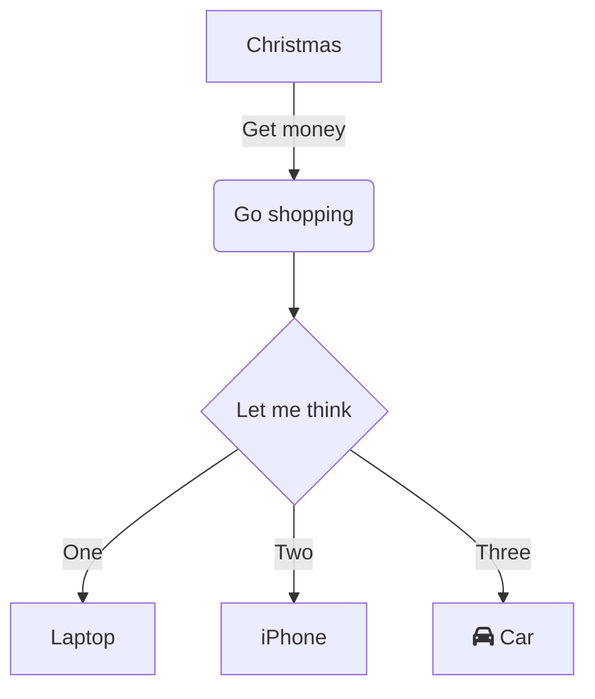

# mermaid diagram


# plantuml diagram

```plantuml
@startuml
title Retail New Customer Activation

autonumber

actor Customer #green
actor Retail_ME #magenta


Header Retail Activation in DASH_APP

Customer -> Retail_ME: Ask for Activation/AAL flow
Retail_ME --> Customer: Greets and starts the order

group#limegreen Login

    Retail_ME -> Tapestry: Login with NTID/Password
    Tapestry -> OKTA: Authenticate and Creates Session
    OKTA --> Tapestry: Session details

    Retail_ME -> Tapestry: Opens DASH_APP homepage

    Tapestry -> DASH_APP: Open DASH_APP App with OKTA Token
    DASH_APP -> OKTA: Valdiates the token
    OKTA --> DASH_APP: Token validation complete
    DASH_APP --> APIGEE: [[https://gitlab.com/tmobile/ace/clearwater/flow-documentation/-/blob/master/swagger/ce.dsg.idm/userEntitlements.json getEntitelements(Load Roles and Permissions)]]
    APIGEE -> IDM: featch entitelements[NTID, ApplicationID]
    IDM --> APIGEE: Roles and Permissions
    APIGEE --> DASH_APP: Roles and Permissions
    DASH_APP -> APIGEE: [[https://gitlab.com/tmobile/ace/clearwater/flow-documentation/-/blob/master/swagger/ce.dsg.idm/UsersSummaryV3.json UserDetails]]
    APIGEE -> IDM: get Agent summary
    IDM --> APIGEE: agent details
    APIGEE --> DASH_APP: agent details
    DASH_APP -> WATSONSharedServices: [[https://bitbucket.service.edp.t-mobile.com/projects/EITCODEDOC/repos/flow-documentation/browse/swagger/ce.fl.pel/WatsonPodConfigAPI.json getStoreID[DeviceSerialNumber]]]
    WATSONSharedServices -> DASH_APP: StoreID
    DASH_APP -> RSP: [[https://servicecatalog.internal.t-mobile.com/servicecat/rsp/2018-12-08/sid/html/StoreService.html#getStoreInfo getStoreInfo(StoreID)]]
    RSP --> DASH_APP: Store details[Address,TaxID]
    DASH_APP -> TIBCO: [[https://servicecatalog.internal.t-mobile.com/servicecat/tibco/2019-08-24/wsdl_api/html/GetStoreLocations.html#LookupRetailStore LookupRetailStore(ApplicationID_POS, StoreID) ]]
    TIBCO --> DASH_APP: StoreCapabilities

end

group#limegreen CreditCheck

    Retail_ME -> DASH_APP: Select the customer Type

    Retail_ME -> Customer: Ask ID to run CreditCheck

    group#limegreen CreditCheck options
        Retail_ME -> DASH_APP: Credit vs No Credit Option

        alt NoCredit Selection
            DASH_APP -> DASH_APP: Doesnt display Employee/TMo Money options
        end

        Retail_ME -> DASH_APP: Employee vs No Employee

        group#limegreen Employee
            DASH_APP -> DASH_APP: Enable Pnumber field, last 4 SSN
        end

        Retail_ME -> DASH_APP: T-Mobile Money Account

        group#limegreen TMobile Money Account
            Retail_ME -> Customer: Explains TMoney benifits
            Customer ->Retail_ME: Opts for TMMoney
            Retail_ME -> DASH_APP: Select TMMoney
            DASH_APP -> DASH_APP: Display Legal agreements for TMMoney

        end

    end
end

Customer ->  Retail_ME: Provides ID
Retail_ME -> DASH_APP: Captures the Customer PhotoID

group#limegreen IDCapture
    DASH_APP -> Tapestry: Enable IDCapture
    Tapestry -> DASH_APP: Display the IDTypes to be capture
    DASH_APP -> DASH_APP: Select the IDtype (DL, Passport, StateID,)
    DASH_APP -> Tapestry : Set the ID Type
    Tapestry -> Tapestry: Enable camera and capture ID front & Back
    Tapestry -> DASH_APP: CaptureID results ( CaptureID, ID info)
    DASH_APP -> DASH_APP: Load id details to CreditCheck form
end

group#limegreen getCityandState
    DASH_APP -> APIGEE: getCityandState
    APIGEE -> Samson: [[https://bitbucket.service.edp.t-mobile.com/projects/DEVPRT/repos/billing-and-charging/browse/Address-4/v4/address-ms-v1-secured.json getCityandStae(zipcode)]]
    Samson --> APIGEE: City and State
    APIGEE --> DASH_APP: City and State
end

group#limegreen addressValidation
    note left: address validation
    DASH_APP -> APIGEE: validateAddress
    APIGEE -> TIBCO: [[https://servicecatalog.internal.t-mobile.com/servicecat/tibco/2019-11-09/wsdl_api/html/Address.html#validateAddress validateAddress]]
    TIBCO --> APIGEE: Success[address details]
    APIGEE --> DASH_APP: Success[address details]
    DASH_APP -> DASH_APP: UpdateCart with Address details
end

group#GreenYellow SignalStrength

    DASH_APP -> PCC_APP: [[https://flows.corporate.t-mobile.com/swagger/ce.dd.re.pcc/pcc-xapis-swagger-v1.json SignalStrengthAPI]]
    PCC_APP -> DASH_APP: Signal Strength
end

group#limegreen dealerCode validation
    Retail_ME -> DASH_APP: Enter dealerCode
    note left: Dealer code will display for permissioned reps only
    DASH_APP -> DASH_APP: Click validate
    DASH_APP -> RSP: [[https://servicecatalog.internal.t-mobile.com/servicecat/rsp/PROD/wsdl_api/html/ReferenceDataService.html#op.d1e5874 getDealerDetails]]
    RSP --> DASH_APP:Success
    DASH_APP --> Retail_ME:Success
end
group BizILCustomer

    Retail_ME -> DASH_APP: enter the company name
    DASH_APP -> APIGEE: [[https://gitlab.com/tmobile/ace/clearwater/flow-documentation/-/blob/master/swagger/ce.dd.tfb/Ongoingdev/v4.0/OAS3-biz-il-program-v4.json /employer/lookup ]]
    APIGEE -> TEA: get Company list
    TEA --> APIGEE: company list
    APIGEE --> DASH_APP: compnay list


end

group#green PIN/PassCode
    Customer -> Retail_ME: Provide PIN/Passcode
    Retail_ME -> DASH_APP: Enters the PIN and Passcode
    DASH_APP -> IAM: [[https://iamcustomlab.t-mobile.com/custom/v1/validatepinformat?pincode=256325 ValidatePIN]]
    IAM --> DASH_APP: validation success
end

group#Gold CreditCheck
    group#GreenYellow PreScreenCreditCheck
        Retail_ME -> DASH_APP: GovtID, Last 4 of SSN and DOB
        DASH_APP -> APIGEE: prescreenCheck
        APIGEE -> CreditDomain: [[https://bitbucket.service.edp.t-mobile.com/projects/EITCODEDOC/repos/flow-documentation/browse/swagger/ce.cfs.credit.co/prescreenCreditOffer_V2.0.json PreScreenCreditCheck]]
        CreditDomain --> APIGEE: PreScreen CreditCheck Results
        APIGEE --> DASH_APP: PreScreen CreditCheck profile
        DASH_APP -> DASH_APP: Update cart with CRP profile
    end

    DASH_APP -> DASH_APP: [[https://flows.geo.pks.t-mobile.com/all-diagrams/sequence_diagrams/dash/modules/creditcheck.puml CredtiCheck]]
    group#GreenYellow FullCreditCheck
        APIGEE --> DASH_APP: PreScreen CreditCheck profile
        DASH_APP -> DASH_APP: Enable FullCreditcheck
        DASH_APP -> APIGEE: ConsumerCreditReport
        APIGEE -> CreditDomain: [[https://bitbucket.service.edp.t-mobile.com/projects/EITCODEDOC/repos/flow-documentation/browse/swagger/ce.cfs.credit.co/consumerCreditReports_V3.0.json FullCreditCheck]]
        CreditDomain --> APIGEE: Full CreditCheck Results
        APIGEE --> DASH_APP: Full CreditCheck profile
        DASH_APP -> DASH_APP: Update cart with CRP profile
        note left: for more details refer to./DASH_CreditCheck.puml
    end
end

group#limegreen TMMOneyEligiblity
    DASH_APP -> APIGEE: [[https://flows.corporate.t-mobile.com/all-swaggers/swagger/ce.dsg.cd/eligibilitycheckresults_v1.json/ EligibilityCheck[CCID]]]
    APIGEE -> CHUB: eligiblityCheckResults
    CHUB -> APIGEE: Eligibility Results
    APIGEE -> DASH_APP: TMMoney Elgibility message
    Retail_ME -> Customer: Inform the TMM result
end

group#limegreen AddDeviceToCart
    Retail_ME -> DASH_APP: Scans the device from Device page
    DASH_APP -> Tapestry: Enable camera for deviceScan
    Tapestry --> DASH_APP: Device details
    DASH_APP -> DASH_APP: Display the scanned device,
    Retail_ME -> DASH_APP: Complete the cart and click on ShoppingCart
    DASH_APP -> DASH_APP: Expland each line and add SIM Number
    DASH_APP -> DASH_APP: Complete Device validation
end

group#limegreen DeviceValidation(DevicePurchase_GSM/MI)

    DASH_APP -> MPOS2:  [[https://pos.internal.t-mobile.com/services/validatepos?wsdl validateSKU]]
    MPOS2 --> DASH_APP: SKUValid
    DASH_APP -> DICE: [[https://bitbucket.service.edp.t-mobile.com/projects/EITCODEDOC/repos/flow-documentation/browse/sequence_diagrams/DICE/DeviceManagement/ce.dsg.dice.dm.deviceStatus.txt DeviceStatus(IMEI)]]
    DICE --> DASH_APP: Devicestatus(blocked,unBlocked)
    DASH_APP -> DICE: [[https://gitlab.com/tmobile/ace/clearwater/flow-documentation/-/blob/master/swagger/ce.dsg.dm/ESIM-V1.json reserveEsimProfile]]
    DICE --> DASH_APP: SIMdetails(resource_status)
    DASH_APP -> SAP_SOA: [[https://developer.t-mobile.com/reference/dev/supply-chain-management#RIS_supplychain_inventorySale_product/operation/validateSerialNumberUsingGET_2 ValidateSerialNumber(DeviceIMEI,DeviceSKU,StoreNumber)]]
    SAP_SOA --> DASH_APP: Invenoty Result
    alt#red nonRISStore
        DASH_APP -> SAP_SOA: [[https://developer.t-mobile.com/reference/dev/supply-chain-management#TETRA_supplychain-hp_devices_search/operation/getDeviceDetailsUsingGET IMEILookup(IMEI)]]
        SAP_SOA --> DASH_APP: IMEI details
    end

    alt#red ManagerOverride
        SAP_SOA --> DASH_APP: InventoryResult[SR504:Invenoty not yet received]
        DASH_APP -> DASH_APP: ManagerOverride
        Retail_ME -> DASH_APP: Enter Manager Credentials
        DASH_APP -> OKTA: Verify Manager Authentication
        OKTA --> DASH_APP: Credentials Verified
        DASH_APP -> APIGEE: [[https://gitlab.com/tmobile/ace/clearwater/flow-documentation/-/blob/master/swagger/ce.dsg.idm/userEntitlements.json getEntitelements(Load Roles and Permissions)]]
        APIGEE -> IDM: get Entitlements [managerNTId, ApplicationId]
        IDM --> APIGEE: Roles and Permissions
        APIGEE -> DASH_APP: Roles and permissions
        DASH_APP -> DASH_APP: If RTS_Manager present, close the popup
        DASH_APP -> DASH_APP: Save ManagerCredentials, Needed in POS handoff
    end

end

group#limegreen DeviceValidation(BYOD)
    DASH_APP -> MPOS2: [[https://pos.internal.t-mobile.com/services/validatepos?wsdl validateSKU]]
    MPOS2 --> DASH_APP: SKUValid
    DASH_APP -> DICE: Optional [[https://bitbucket.service.edp.t-mobile.com/projects/EITCODEDOC/repos/flow-documentation/browse/sequence_diagrams/DICE/DeviceManagement/ce.dsg.dice.dm.deviceStatus.txt DeviceStatus(IMEI)]]
    DICE --> DASH_APP: Devicestatus(blocked,unBlocked)
    DASH_APP -> TIBCO: [[https://servicecatalog.internal.t-mobile.com/servicecat/tibco/2019-08-24/wsdl_api/html/Device.html#getSIMDtls getSIMDtls_Tibco(SIMNumber,CSN,EID)]]
    TIBCO --> DASH_APP: SIMdetails(resource_status)
    DASH_APP -> SAP_SOA: [[https://developer.t-mobile.com/reference/dev/supply-chain-management#RIS_supplychain_inventorySale_product/operation/validateSerialNumberUsingGET_2 ValidateSerialNumber(SIMNumber,SIMSKU,StoreNumber)]]
    SAP_SOA --> DASH_APP: Invenoty Result

    alt#red ManagerOverride
        SAP_SOA --> DASH_APP: InvebtoryResult[SR503:Invenoty not yet received]
        DASH_APP -> DASH_APP: Ignore ManagerOverride
        note right: DASH_APP wont ask for Manager Override for SIM Transaction
    end

end

DASH_APP -> DASH_APP: Enable Checkout in miniCart
Retail_ME -> DASH_APP: Click on Checkout
DASH_APP -> DASH_APP: Moves to next Customer info page
note right: DASH_APP display popup with Tradein, Accessory and PriceAgjustments

Retail_ME -> DASH_APP: Select the PPU, e911 and Wifi calling options
DASH_APP -> DASH_APP: Address validation for each change

Retail_ME -> DASH_APP: Choose NpaNxx with ZipCode
DASH_APP -> Samson: [[https://developer.t-mobile.com/reference/dev/billing-and-charging#DigitalBilling-NorthStar_Resource-Management_number/operation/npaNxxCombinations NumberManagement.getNpaNxx(postal-code=?zipcode)]]
Samson --> DASH_APP: Npa Nxx combinations[NpaNxx with NumberInventory]
Retail_ME -> DASH_APP: Complete the NpaNxx Selection for all lines

Retail_ME -> DASH_APP: Proceed to BillingInfo
DASH_APP -> Samson: [[https://developer.t-mobile.com/reference/dev/billing-and-charging#DigitalBilling-NorthStar_Resource-Management_number/operation/npaNxxCombinations NumberManagement.getNpaNxx(postal-code=?zipcode)]][[https://developer.t-mobile.com/reference/dev/billing-and-charging#DigitalBilling-NorthStar_Resource-Management_number/operation/reserveNumber reservNumber]]
Samson --> DASH_APP: MSISDN for each line

alt#red No MSISDNs
    Samson --> DASH_APP: Unable to reserve Number
    DASH_APP -> DASH_APP: Display exception
    Retail_ME -> DASH_APP: Provides new ZipCode
end

group#green portin
    Retail_ME -> DASH_APP: Portin details
    DASH_APP -> TIBCO: [[https://servicecatalog.internal.t-mobile.com/servicecat/tibco/2019-08-24/wsdl_api/html/PortInService.html#checkPortInEligibility Portin.CheckPortinEligibility(MSISDN,CarrierCode)]]
    TIBCO --> DASH_APP: Portin Eligiblity Status
end

Retail_ME -> DASH_APP: Proceed to Activation summary page

Retail_ME -> DASH_APP: Autopay setup
DASH_APP -> DASH_APP: Collect Credit card details

DASH_APP -> DASH_APP: Diplay the activation summary and read to activate

Retail_ME -> DASH_APP: Click on Submit for activation

Group Activation

    group CreateTentativeBAN
        DASH_APP -> TIBCO: [[https://servicecatalog.internal.t-mobile.com/servicecat/tibco/2019-08-24/sid/html/AccountManagement.html#CreateTentativeBan CreateTentativeBAN(CustomerProfile)]]
        TIBCO -> Samson: Create TBan Tuxedo call
        Samson --> TIBCO: TBAN
        TIBCO --> DASH_APP: TBAN

        alt TBANFailure
            TIBCO --> DASH_APP: TBAN Failure
            DASH_APP --> DASH_APP: display the error and doesnt proceed for activation
            Retail_ME -> DASH_APP: Resubmit the activation
            DASH_APP -> TIBCO: will retry to create tentativeBAN
        end
    end

    group UpdateCRID AsyncCall

        DASH_APP -> CreditDomain: [[https://bitbucket.service.edp.t-mobile.com/projects/CFSC/repos/swagger/browse/accountCreditInformation.json UpdateCRID(TBAN,CRID)]]
        CreditDomain -> Samson: Update CRID with TBAN
        CreditDomain --> DASH_APP: Update CRID Status

        alt UpdateCRID Failure
            CreditDomain --> DASH_APP: API failure
            DASH_APP -> WCS: Update DASH_APP DB with TBAN and UpdateStatus
            DASH_APP -> DASH_APP: Scheduler updates CRID with TBAN [3 retries]
        end
    end

    group RSPActivation

        DASH_APP -> RSP: [[https://servicecatalog.internal.t-mobile.com/servicecat/rsp/2018-12-08/wsdl_api/html/ActivationService.html#activateSubscribers Activate.postpaidSubscriber(CustomerProfile,Softgoods)]]
        RSP -> Samson: Validate & Activate
        Samson --> RSP: Activation Results
        RSP --> DASH_APP: Activation Results[All lines activated]
        DASH_APP -> MPOS2: Redirects with token

        alt FewLinesActivated
            RSP --> DASH_APP: Activation Results[Few lines activated]
            DASH_APP -> DASH_APP: Activation Results page with linelevl erros
            DASH_APP -> DASH_APP: Continue to POS button
            note right: DASH_APP will handoff only succesful activated lines
        end

        alt depositflow
            RSP --> DASH_APP: Activation Results[Few lines activated]
            DASH_APP -> DASH_APP: Activation Results page with linelevl erros
            DASH_APP -> DASH_APP: Rearrange the Deposit amounts
        end

        alt AllLinesFailure
            RSP --> DASH_APP: Activation Results[ALL lines activated]
            DASH_APP -> DASH_APP: Display the line level error
            DASH_APP -> DASH_APP: StartNewOrder will be displayed
        end
    end

    group UpdateAuthorizedUser
        DASH_APP -> RSP: [[https://servicecatalog.internal.t-mobile.com/servicecat/rsp/2018-12-08/sid/html/AccountUpdateService.html#updateAuthorizedUserName RSP.UpdateAuthorizedUser(BAN,AuthorizedUserName) ]]
        RSP -> Samson: Tuxedo to add users
        RSP --> DASH_APP: Service response

        alt APIFailure
            RSP --> DASH_APP: API failure
            DASH_APP --> DASH_APP: Put Exception in Activation results page.
        end

    end

    group AutopaySetup
        DASH_APP -> APIGEE: [[https://flows.corporate.t-mobile.com/all-swaggers/swagger/cc.dps/managepaymentsinstrumentsv4.json/ ManagePayment(Autopay, Retail)]]
        APIGEE -> DPS: ManagePaymentInstruments[Autopay]
        DPS --> APIGEE: $0AuthResponse
    end

    group TokenCreation

        DASH_APP -> RSP: Generate Token toggledata(OrderID,BAN,Session)
        RSP --> DASH_APP: EnterpriseToken

    end

    group handoff

        DASH_APP -> MPOS2: Redirect with POS URL + Token
        DASH_APP -> IDW_BI : Post the order to kafka queue

    end

end


MPOS2 -> RSP : [[https://servicecatalog.internal.t-mobile.com/servicecat/rsp/2018-08-25/wsdl_api/wsdl/EnterpriseTokenService.wsdl RSP EnterpriseTokenService]] validateToken
RSP -[#Green]--> MPOS2 : Success (token data)
MPOS2 -> "Watson DB" : Validating user
"Watson DB" -> MPOS2 : user details
MPOS2 -> APIGEE : API to retrieve order details
APIGEE -[#Green]--> MPOS2 : Success
MPOS2 -> TIBCO : [[https://servicecatalog.internal.t-mobile.com/servicecat/tibco/2018-11-04/wsdl_api/html/AccountLookup.html TIBCO AccountLookup]] GetAccountDetails
TIBCO -[#Green]--> MPOS2 : Success

MPOS2 -> TIBCO : [[https://servicecatalog.internal.t-mobile.com/servicecat/tibco/2018-11-04/wsdl_api/wsdl/AccountSearch.wsdl TIBCO AccountSearch]] GetSubscribersForBanv2
TIBCO -[#Green]--> MPOS2 : Success

MPOS2 -> RSP: [[https://servicecatalog.internal.t-mobile.com/servicecat/rsp/2018-08-25/wsdl_api/wsdl/SimService.wsdl RSP SimService]] getStarterKitFee
RSP -[#Green]--> MPOS2 : Success
==Item Entry screen==
MPOS2 -> RSP: [[https://servicecatalog.internal.t-mobile.com/servicecat/rsp/2018-08-25/wsdl_api/wsdl/OfferService.wsdl RSP OfferService]] lookupDecisionValues
RSP -[#Green]--> MPOS2 : Success
MPOS2 -> TIBCO : [[https://servicecatalog.internal.t-mobile.com/servicecat/tibco/2018-11-04/wsdl_api/wsdl/Installment.wsdl TIBCO Installment]] GetCreditRiskProfile
TIBCO -[#Green]--> MPOS2 : Success
MPOS2 -> TIBCO : [[https://servicecatalog.internal.t-mobile.com/servicecat/tibco/2018-11-04/wsdl_api/wsdl/Installment.wsdl TIBCO Installment]] GetCreditLineSummary
TIBCO -[#Green]--> MPOS2 : Success
MPOS2 -> TIBCO : [[https://servicecatalog.internal.t-mobile.com/servicecat/tibco/2018-11-04/wsdl_api/wsdl/Installment.wsdl TIBCO Installment]] GetEquipmentInstallmentIndicators
TIBCO -[#Green]--> MPOS2 : Success
==Adding items to cart==
MPOS2 -> RSP : [[https://servicecatalog.internal.t-mobile.com/servicecat/rsp/2018-08-25/wsdl_api/wsdl/SimService.wsdl RSP Sim]] getStarterKitFee
RSP -[#Green]--> MPOS2 : Success
MPOS2 -> TIBCO : [[https://servicecatalog.internal.t-mobile.com/servicecat/tibco/2018-11-04/wsdl_api/wsdl/Installment.wsdl TIBCO Installment]] GetPendingDeposit
TIBCO -[#Green]--> MPOS2 : Success
alt non-RIS store
    MPOS2 -> APIGEE : getDeviceDetails (Holderplace API)
    APIGEE -> MPOS2 : Success
else RIS store
    MPOS2 -> SOA :  [[SOA SerialNumber Validation]]ValidateSerialNumber
    SOA -[#Green]--> MPOS2 : Success
end
==Estimate Installments==
MPOS2 -> APIGEE : [[https://bitbucket.service.edp.t-mobile.com/projects/EITCODEDOC/repos/flow-documentation/browse/swagger/cf.loan.origination/CFS-estimateLoan.json APIGEE loans]] loan-bundle-quotes
APIGEE -[#Green]--> MPOS2 : Success
==Trade-In==
alt Trade-In
    MPOS2 -> TIBCO : [[https://servicecatalog.internal.t-mobile.com/servicecat/rsp/2018-08-25/wsdl_api/wsdl/EnterpriseTokenService.wsdl RSP EnterpriseTokenService]] generateToken
    TIBCO -[#Green]--> MPOS2 : Success
    MPOS2 -> QuoteTool : Handoff
    QuoteTool -> MPOS2 : Quote Details
else Decline Trade-In
    MPOS2 -> MPOS2 : Go to Tender screen


    ==Balance Payment==
    MPOS2 -> TIBCO : [[https://servicecatalog.internal.t-mobile.com/servicecat/tibco/2018-11-04/wsdl_api/wsdl/Installment.wsdl TIBCO Installment]] GetInstallmentPlanHistory
    TIBCO -[#Green]--> MPOS2 : Success
    MPOS2 -> RSP: [[https://servicecatalog.internal.t-mobile.com/servicecat/rsp/2018-08-25/wsdl_api/wsdl/OfferService.wsdl RSP OfferService]] lookupDecisionValues
    RSP -[#Green]--> MPOS2 : Success
    MPOS2 -> TIBCO : [[https://servicecatalog.internal.t-mobile.com/servicecat/tibco/2018-11-04/wsdl_api/wsdl/Installment.wsdl TIBCO Installment]] GetEquipmentInstallmentIndicators
    TIBCO -[#Green]--> MPOS2 : Success
end

==Tender screen==
MPOS2 -> TIBCO : [[https://servicecatalog.internal.t-mobile.com/servicecat/tibco/2018-11-04/wsdl_api/wsdl/TaxQuote.wsdl TIBCO TaxQuote]] /TAX/TAX/QUOTE
TIBCO -[#Green]--> MPOS2 : Success

alt Receive items in RIS store
    MPOS2 -> APIGEE : Receive inventory to store
    APIGEE -[#Green]--> MPOS2 : Success
end
==Capturing Signature==
alt  Trade-In (Instant or Deferred)
    MPOS2 -> TIBCO : [[https://servicecatalog.internal.t-mobile.com/servicecat/tibco/2018-11-04/wsdl_api/wsdl/DeviceTradeInService.wsdl TIBCO DeviceTradeInService]] setQuoteDisposition
    TIBCO -[#Green]--> MPOS2 : Success
end

MPOS2 -> APIGEE : [[https://bitbucket.service.edp.t-mobile.com/projects/EITCODEDOC/repos/flow-documentation/browse/swagger/cf.loan.origination/CFS-createLoan.json APIGEE loans]] loan-bundles
APIGEE -[#Green]--> MPOS2 : Success

MPOS2 -> APIGEE : [[https://bitbucket.service.edp.t-mobile.com/projects/EITCODEDOC/repos/flow-documentation/browse/swagger/ce.cfs.documents/E-Signature%20Agreements.swagger.json  APIGEE Document_Generation]] DocGen
APIGEE -[#Green]--> MPOS2 : Success (Document URL)

MPOS2 -> DocuSign : Redirect to Docusign to capture e-signature
DocuSign -[#Green]--> MPOS2 : Redirect back to MPOS2
alt wet signature option
    MPOS2 ->MPOS2: Show wet signature options
    alt complete transaction
        MPOS2->APIGEE : [[https://bitbucket.service.edp.t-mobile.com/projects/EITCODEDOC/repos/flow-documentation/browse/swagger/ce.cfs.esign/disclosureStatus.swagger.json APIGEE Disclosure_Status]] Disclosure status - sign on file as true
        APIGEE -[#Green]--> MPOS2 : Success
        alt Disclosure API failure
            MPOS2->MPOS2 : Ask user to cancel transaction if API fails 3 times
            MPOS2 -> TIBCO: cancelInstallmentPlan
            TIBCO -[#Green]--> MPOS2 : Success
            alt trade in
                MPOS2 -> TIBCO: cancelTradein
                TIBCO -[#Green]--> MPOS2 : Success
            end
        end
    end
    alt Cancel transaction
        MPOS2->APIGEE : [[https://bitbucket.service.edp.t-mobile.com/projects/EITCODEDOC/repos/flow-documentation/browse/swagger/ce.cfs.esign/disclosureStatus.swagger.json APIGEE Disclosure_Status]] Disclosure status - sign on file as false
        APIGEE -[#Green]--> MPOS2 : Success

        MPOS2 -> TIBCO: cancelInstallmentPlan
        TIBCO -[#Green]--> MPOS2 : Success
        alt trade in
            MPOS2 -> TIBCO: cancelTradein
            TIBCO -[#Green]--> MPOS2 : Success
        end
    end
end

==Payment processing==
alt Payment options
    alt card payments
        MPOS2 -> TIBCO : [[https://servicecatalog.internal.t-mobile.com/servicecat/tibco/2018-11-04/wsdl_api/wsdl/TaxQuote.wsdl TIBCO TaxQuote]] /TAX/TAX/QUOTE
        TIBCO -[#Green]--> MPOS2 : Success
        MPOS2 -> APIGEE : [[https://qwiki.internal.t-mobile.com/download/attachments/116635581/CardTypeValidationAPI-v2.json?version=1&modificationDate=1518212300000&api=v2 cardtypevalidation]] cardtypevalidation
        APIGEE -> MPOS2 : Success
        MPOS2 -> APIGEE : [[https://qwiki.internal.t-mobile.com/pages/viewpage.action?title=Swagger+Repository&spaceKey=JCM paymenttxnlookup]] paymenttxnlookup
        APIGEE -> MPOS2 : Success
        MPOS2 -> APIGEE : [[https://qwiki.internal.t-mobile.com/pages/viewpage.action?title=Swagger+Repository&spaceKey=JCM cpsales]] cpSales
        APIGEE -> MPOS2 : Success
    end
    alt cash payments
        MPOS2 -> TIBCO : [[https://servicecatalog.internal.t-mobile.com/servicecat/tibco/2018-11-04/wsdl_api/wsdl/Payment.wsdl TIBCO Payment]] ProcessFraudCheck
        TIBCO -[#Green]--> MPOS2 : Success
        alt Tablet cash payments
            alt network cash drawers
                MPOS2 -> TIBCO : [[https://servicecatalog.internal.t-mobile.com/servicecat/tibco/2019-05-18/wsdl_api/html/CashDrawerService.html#manageCashDrawer Manage_Cash_Drawer]] Manage cash drawer
                TIBCO -[#Green]--> MPOS2 : Success
            end
            alt IOT networkcash drawers for TPRi store
                MPOS2 -> APIGEE : [[https://bitbucket.service.edp.t-mobile.com/users/ssiri2/repos/flow-documentation/browse/swagger/ccd/CCDxApi_Swagger_1.0.0.json IOT_cash_drawer]] Open IOT cash drawer for TPRi stores
                APIGEE -> MPOS2 : Success
            end
        end
    end
end

alt RIS store
    MPOS2 -> APIGEE : UpdateInventoryWithSaleItems
    APIGEE -[#Green]--> MPOS2 : Success
    MPOS2 -> APIGEE : UpdateInventoryWithReturnItems
    APIGEE -[#Green]--> MPOS2 : Success
end

MPOS2 -> TIBCO : POS-PDM XML (posted to tibco queue)
MPOS2 -> TIBCO : [[https://servicecatalog.internal.t-mobile.com/servicecat/tibco/2018-11-04/wsdl_api/wsdl/PublicInsertMemo.wsdl TIBCO PublicInsertMemo]] /MEMO/INSERT
TIBCO -[#Green]--> MPOS2 : Success


MPOS2 -> TESA : TesaTransferData
TESA -> MPOS2 : Receipt PDF

MPOS2 -> APIGEE : [[https://bitbucket.service.edp.t-mobile.com/projects/EITCODEDOC/repos/flow-documentation/browse/swagger/ce.cfs.documents/retrievedocument.swagger.json   APIGEE Retrieve_Document]] Retrieve Document for printing
APIGEE -[#Green]--> MPOS2 : Success (PDF Content)


alt Deferred trade-in
    MPOS2 -> TIBCO : [[https://servicecatalog.internal.t-mobile.com/servicecat/tibco/2019-05-18/wsdl_api/html/DeviceTradeInService.html#getShippingLabel TIBCO Shipping_Label]] Generate Shipping label
    TIBCO -[#Green]--> MPOS2 : Success
end
@enduml
```
