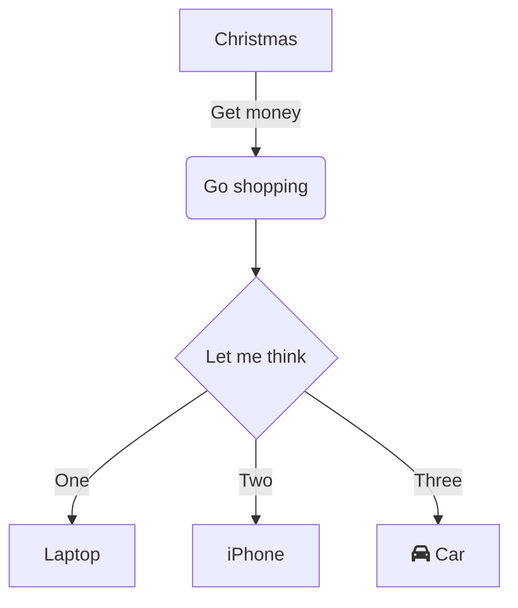

# SMS

SMS domain provides complete lifecycle API's for sending and receiving text-based messages for a given consumer. 
The messaging capabilities are provided primarily thru the messages resource below

- [Messages](/products/sms?sectionName=messages)

## Resource Model 
The APIs follow a common schema based on the resource definitions below.

@startuml
Bob -> Alice : hello
@enduml
